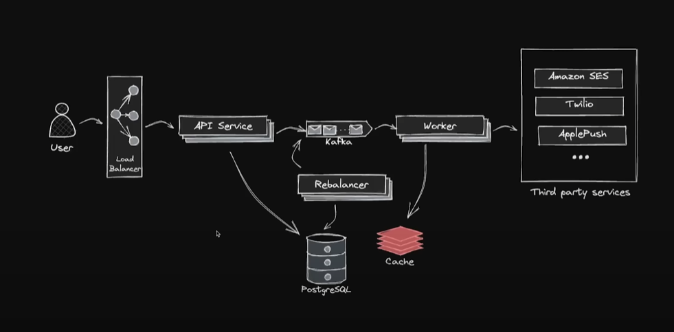

## For Ukrainian, click [here](README_UA.md). 

# Emergency Notification System API

## Description:
An emergency notification system for critical situations. The service allows users to send notifications to their social circle in case of emergencies.
Users have the ability to create message templates and, with the press of a single button, notify their social circle that an emergency has occurred or is currently happening.

## Terms of Reference:
- Upload contacts via `.csv` or `.xls` file.
- Create message templates and assign necessary recipients.
- Automatically send notifications to recipients' devices when sending a notification to the entire group.
- The system supports sending notifications to up to a million recipients.
- The system should account for potential server failures during the notification process.
- All users must receive the notification, regardless of server failures.

## System Architecture:

## Key Features:
1. **User Management**:
    - Upload users and their emergency contacts via `.csv` or `.xls` files.
    - Each user can manage a list of contacts who will receive notifications in case of an emergency.

2. **Notification Templates**:
    - Users can pre-configure messages for different types of emergencies (e.g., fire, medical assistance, etc.).
    - Configurable templates allow selecting specific contacts or groups of contacts.

3. **Mass Notification Sending**:
    - Notifications are sent to all designated contacts simultaneously, ensuring high scalability (up to 1 million recipients).
    - Supports various communication channels such as SMS, email, or push notifications.

4. **Failure Resilience**:
    - The system should correctly handle possible server failures during the notification process, ensuring that unsent messages are not lost.
    - Mechanisms for retrying and message queuing (such as RabbitMQ) are used to ensure delivery even in case of temporary failures.

5. **Scalability**:
    - The system is designed to support mass notification sending to millions of recipients.
    - A microservices architecture with event-driven processes is used for scalability and fault tolerance.

## Technology Stack:
- **Backend**: Java with Spring Boot, microservice architecture (Spring Cloud).
- **Message Queue**: RabbitMQ for reliable message delivery.
- **Database**: PostgreSQL for data storage.
- **File Processing**: Apache POI (for XLS) and OpenCSV (for CSV).
- **Deployment**: Docker and Kubernetes (for orchestration and scaling).
